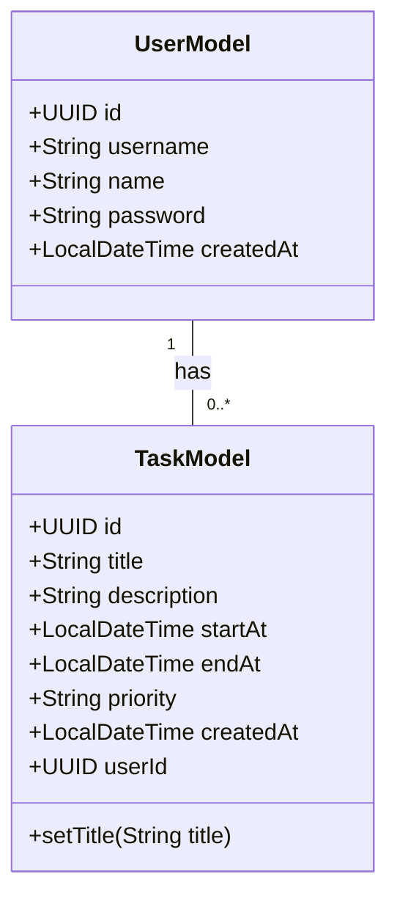

# TODO List
Java Restful API used to create a TODO List

## Class diagram

```mermaid
classDiagram
    class UserModel {
        +UUID id
        +String username
        +String name
        +String password
        +LocalDateTime createdAt
    }

    class TaskModel {
        +UUID id
        +String title
        +String description
        +LocalDateTime startAt
        +LocalDateTime endAt
        +String priority
        +LocalDateTime createdAt
        +UUID userId
        +setTitle(String title)
    }

    UserModel "1" -- "0..*" TaskModel : has

```
